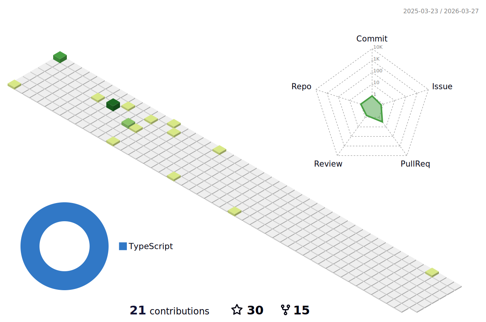

 
 

- 👋 Hi, I’m @kakachake
- 📫 Email:  theeasylife@foxmail.com
- 💻 Blog: https://kakachake.github.io/

<a href="https://github.com/kakachake">
  

  
  
 

</a>

 
<h2>我的作品🚩</h2>

|  | 简介 | 类型 |
| --- | --- | --- |
|<a href="https://github.com/kakachake/cloud_music_monorepo">React Netease Music</a>| 一个基于 React、TypeScript 的高仿网易云播放器 | 练手项目 |
|<a href="https://github.com/kakachake/resume-electron">Resume Electron</a>| 一个基于 React、TypeScript、Electron 的简历制作平台 | 练手项目 |
|<a href="https://github.com/kakachake/mini_zvm">Mini Zvm</a>| 简化版的vue实现 | 源码实现 |
|<a href="https://github.com/kakachake/mini-react-router">Mini React Router</a>| 从 0 到 1 实现的 react router 路由功能 | 源码实现 |
|<a href="https://github.com/kakachake/BuildMyReact">Build My React</a>| 简易的React实现 | 源码实现 |
|<a href="https://github.com/kakachake/create-want">Create want app</a>| 前端项目脚手架工具 | 源码实现 |
|<a href="https://github.com/kakachake/create-want">shttp</a>| 基于nodejs的http server简易实现 | 源码实现 |
|<a href="https://github.com/kakachake/easy-bezier-animation">shttp</a>| 快速贝塞尔动画实现 | 开源项目 |
 
<h2>Skills</h2>

  

  
<b>:gear: &nbsp;Git statistics</b>

 
 
 

