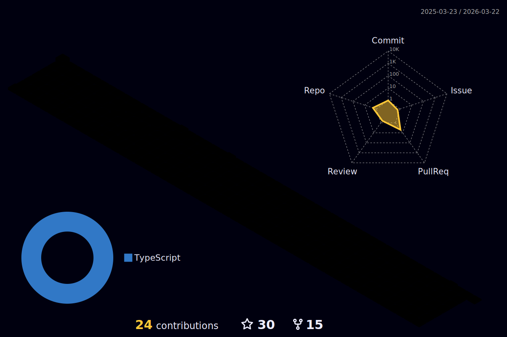

- 👋 Hi, I’m @kakachake
- 📫 Email:  theeasylife@foxmail.com
- 💻 Blog: https://kakachake.github.io/

<a href="https://github.com/kakachake">
  

  
  
 

</a>

 
<h2>My Open Source🚩</h2>

| 开源项目 | 简介 | 类型 |
| --- | --- | --- |
|<a href="https://github.com/kakachake/cloud_music_monorepo">React Netease Music</a>| 一个基于 React、TypeScript 的高仿网易云播放器 | 高仿项目 |
|<a href="https://github.com/kakachake/mini_zvm">mini_zvm</a>| 简化版的vue实现 | 源码实现 |
|<a href="https://github.com/kakachake/mini-react-router">mini-react-router</a>| 从 0 到 1 实现的 react router 路由功能 | 源码实现 |

 
<h2>Skills</h2>

  

  
<b>:gear: &nbsp;Git statistics</b>

 
 
 

